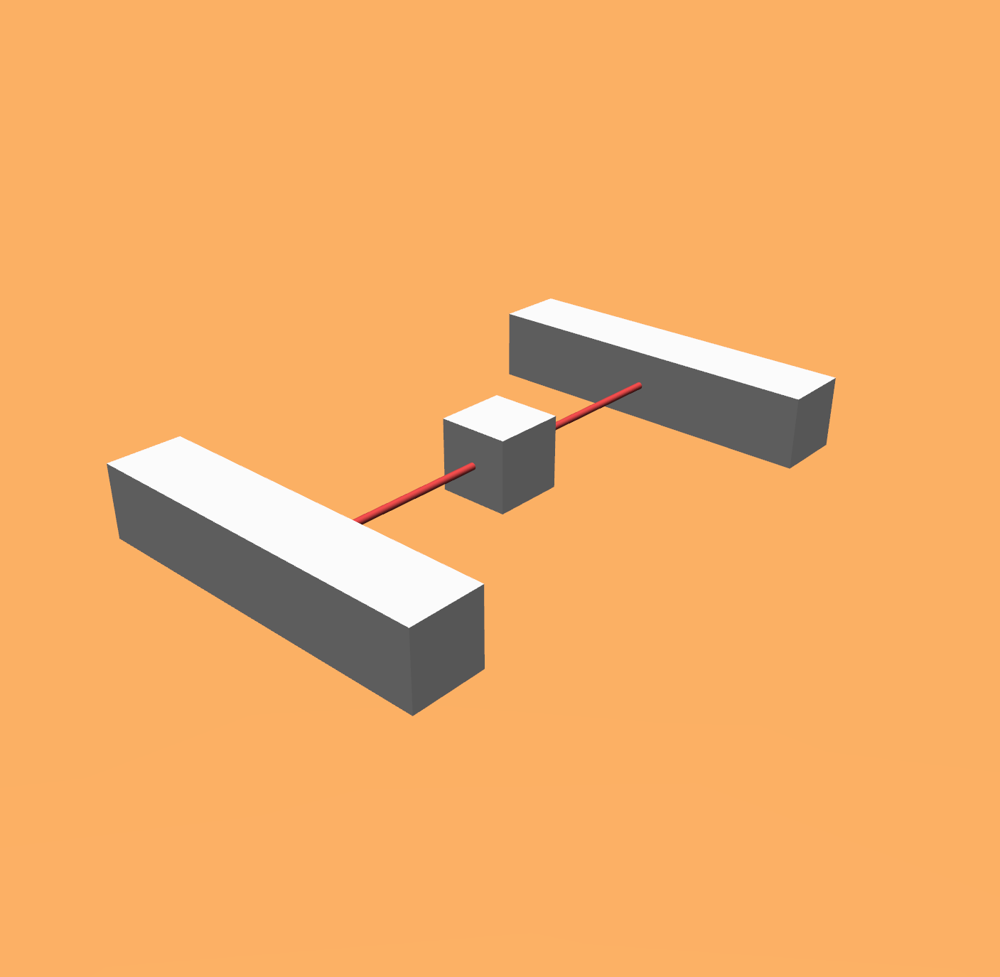
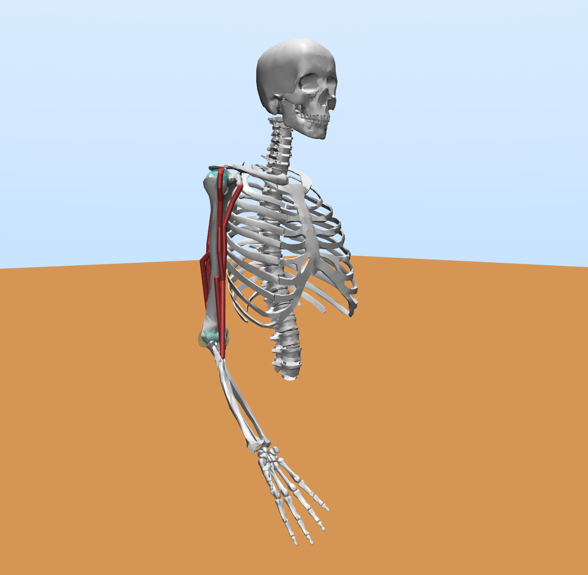
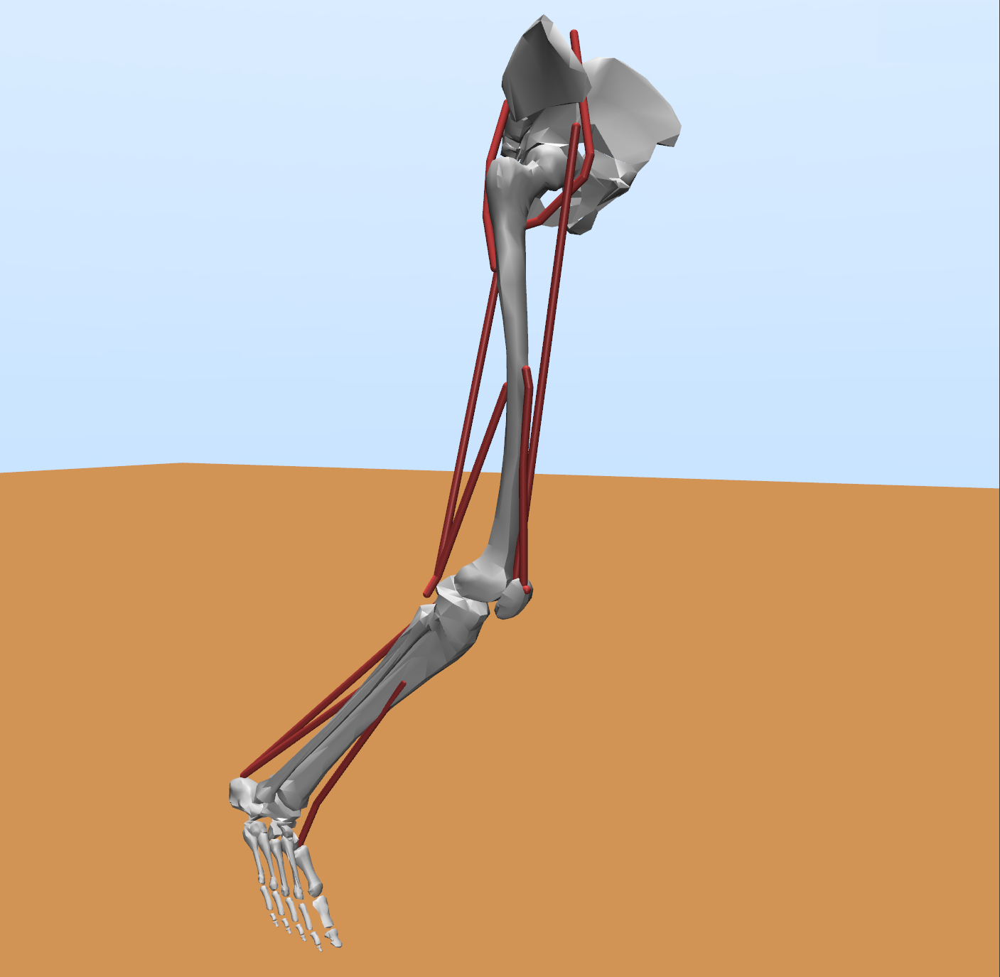
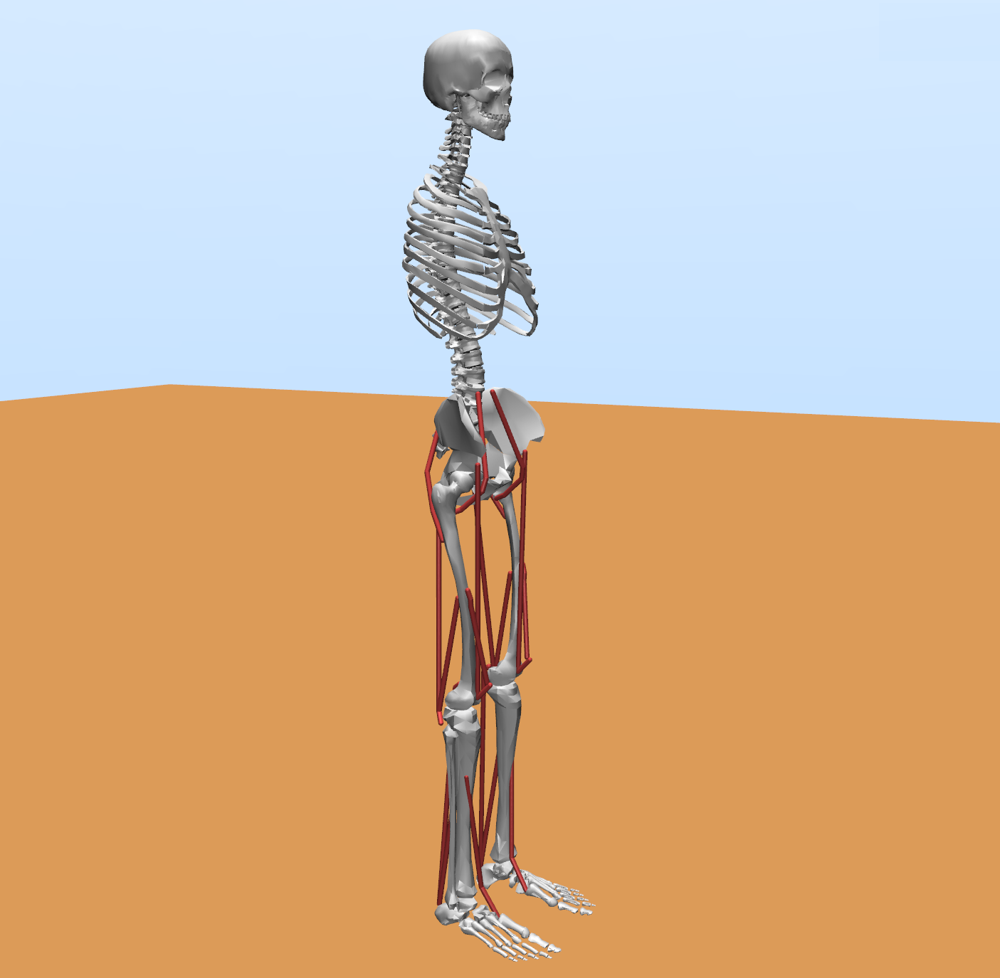
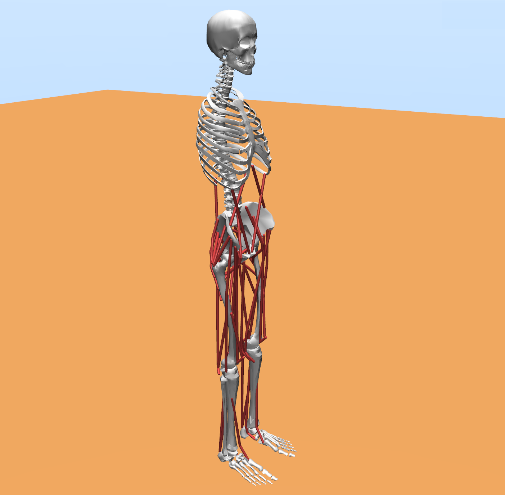
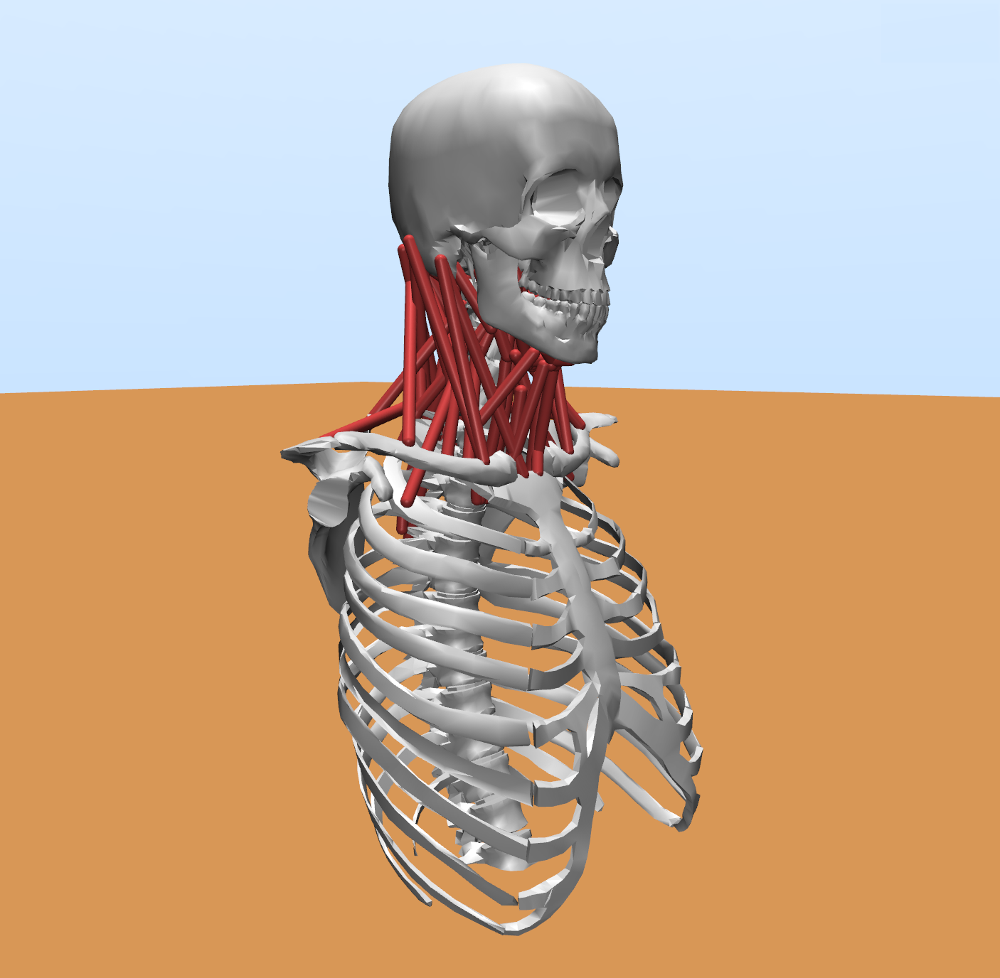

<p align="center">

</p>

[](https://myoconverter.readthedocs.io/en/latest/)
[](docs/source/participate.rst)
[](https://github.com/opensim-org/opensim-core/blob/master/LICENSE.txt)
<!-- [](https://pepy.tech/project/myosuite)
[](https://colab.research.google.com/drive/1U6vo6Q_rPhDaq6oUMV7EAZRm6s0fD1wn?usp=sharing) -->

# MyoConverter
**MyoConverter** is a tool for converting OpenSim musculoskeletal (MSK) models to the MuJoCo model format with optimized muscle kinematics and kinetics.

Building upon the foundation of the previous [O2MConverter](https://github.com/aikkala/O2MConverter) project, we extensively rewrote the functions, incorporated new features, and ensured compatibility with the latest OpenSim 4.0+ models. Additionally, two optimization steps were introduced to enhance the accuracy of muscle properties in both kinematics and kinetics.

The aim of MyoConverter is to replicate OpenSim models in MuJoCo format as faithfully as possible. This means that any possible errors in the original OpenSim models are likely to remain in the MuJoCo model. Hence, the converted models may not be suitable for research purposes as such, but may require further adjustments. Models with further manual adjustments, ensuring their suitability for functional task simulations, can be found in the [MyoSim](https://github.com/MyoHub/myo_sim) project, which builds on models converted by MyoConverter.

We evaluate the accuracy of the converter with a handful of models. However, these models do not cover all possible features of OpenSim models. Hence, when converting a new model, there is a chance the conversion fails due to a missing implementation. In this case, you can open an issue, or, preferably, [contribute](https://myoconverter.readthedocs.io/en/latest/participate.html) to the project and create a pull request.


 [External Model List](https://myoconverter.readthedocs.io/en/latest/models.html) | [Documentation](https://myoconverter.readthedocs.io/en/latest/index.html)
| [MyoSuite](https://sites.google.com/view/myosuite/myosim?authuser=0) | [Current Limitations](https://myoconverter.readthedocs.io/en/latest/limitations.html)

## Example models
Here we present a collection of models, as examples, that have been processed with the MyoConverter tool. We try to keep these converted models up-to-date (in case of bug fixes etc.), but it is recommended to run the conversions yourself to ensure up-to-date models.

|   | Model name| Source | Validation | Conversion Speed |
|--------------------|--------------|:-------:|:--------:|-------|
|| [Tug of War](models/mjc/TugOfWar/tugofwar_cvt3.xml) <br> - 1 DoF <br> - 2 Muscles | [Osim](https://github.com/MyoHub/myoconverter/tree/main/models/osim/TugOfWar)  |   [Report](models/mjc/TugOfWar/tugofwar.pdf) | Regular: 30 sec <br> Speedy: 30 sec |
|| [Simple Arm](https://github.com/MyoHub/myo_sim/blob/main/elbow/myoelbow_2dof6muscles.xml)  <br> - 2 DoFs <br> - 6 Muscles <br> * *In MyoSim* | [Osim](https://github.com/MyoHub/myoconverter/tree/main/models/osim/Arm26)  |   [Report](models/mjc/Arm26/arm26.pdf) | Regular: 5 min 30 sec <br> Speedy: 4 min 37 sec |
|| [Single Leg](models/mjc/Leg6Dof9Musc/leg6dof9musc_cvt3.xml)   <br> - 6 DoFs <br> - 9 Muscles | [Osim](https://github.com/MyoHub/myoconverter/tree/main/models/osim/Leg6Dof9Musc)  |   [Report](models/mjc/Leg6Dof9Musc/leg6dof9musc.pdf) | Regular: 4 min 3 sec <br> Speedy: 3 min 41 sec |
|| [2D Gait Model](models/mjc/Gait10dof18musc/gait10dof18musc_cvt3.xml) <br> - 10 DoFs <br> - 18 Muscles | [Osim](https://github.com/MyoHub/myoconverter/tree/main/models/osim/Gait10dof18musc)  |   [Report](models/mjc/Gait10dof18musc/gait10dof18musc.pdf) | Regular: 8 min 21 sec <br> Speedy: 7 min 33 sec |
|| [3D Gait Model](models/mjc/Gait2354Simbody/gait2354_cvt3.xml)  <br> - 23 DoFs <br> - 54 Muscles | [Osim](https://github.com/MyoHub/myoconverter/tree/main/models/osim/Gait2354Simbody)  |   [Report](models/mjc/Gait2354Simbody/gait2354.pdf) | Regular: 34 min 21 sec <br> Speedy: 22 min 58 sec |
|| [Neck Model](models/mjc/Neck6D/neck6d_cvt3.xml) <br> - 6 DoFs <br> - 72 Muscles | [Osim](https://github.com/MyoHub/myoconverter/tree/main/models/osim/Neck6D)  |   [Report](models/mjc/Neck6D/neck6d.pdf) | Regular: 200 min 14 sec <br> Speedy: 57 min 43 sec |


Please also see [this list of models](https://myoconverter.readthedocs.io/en/latest/models.html) converted using MyoConverter.


## Download & Setup

### conda / mamba

If you would like to convert your own MSK model, follow the steps outlined below:

- Clone the repo
```bash
git clone git@github.com:MyoHub/myoconverter.git; cd myoconverter
```

- Create a conda environment with the `conda_env.yml` file
```bash
conda env create -n myoconverter -f conda_env.yml
conda activate myoconverter
```

**Note** conda is very slow in solving the dependencies and installing the environment (>15 minutes). We recommend installation via [mamba](https://mamba.readthedocs.io/en/latest/installation.html) instead, which installs the environment in a couple of minutes. With mamba, the environment is created by replacing `conda` with `mamba`:
```bash
mamba env create -n myoconverter -f conda_env.yml
mamba activate myoconverter
```

- Optional: Test installation by running a model unit test
```bash
python myoconverter/tests/model_unit_test.py
```

### Docker

We also provide a docker image that has MyoConverter installed. Please follow [this link](./docker/README.md) for further instructions.


## Quick example

#### Call a Python function

```python
from myoconverter.O2MPipeline import O2MPipeline

# define pipline configurations
kwargs = {}  # define kwargs inputs
kwargs['convert_steps'] = [1, 2, 3]    # All three steps selected
kwargs['muscle_list'] = None           # No specific muscle selected, optimize all of them
kwargs['osim_data_overwrite'] = True   # Overwrite the Osim model state files
kwargs['conversion'] = True            # Yes, perform 'Cvt#' process
kwargs['validation'] = True            # Yes, perform 'Vlt#' process
kwargs['speedy'] = False                # Do not reduce the checking notes to increase speed
kwargs['generate_pdf'] = True          # Do not generate validation pdf report
kwargs['add_ground_geom'] = True       # Add ground to the model
kwargs['treat_as_normal_path_point'] = False    # Using constraints to represent moving and conditional path points


############### Simple Arm 2 DoFs 6 Muscles ################ 
osim_file = './models/osim/Arm26/arm26.osim'
geometry_folder = './models/osim/Arm26/Geometry'
output_folder = './models/mjc/Arm26'
O2MPipeline(osim_file, geometry_folder, output_folder, **kwargs)
```

More examples can be found in the example folder in converting other example models. Detail explaination of the conversion setup/process is location in the doc. 


## Contribution
We highly encourage both users and experts to actively contribute to this open-source software. By sharing your insights and expertise, you can help enhance the functionality and maintenance of MyoConverter for the benefit of all users. For more detailed information about the tool, please refer to the [documentation](https://myoconverter.readthedocs.io/en/latest/index.html).


## Citation
```BibTeX
@inproceedings{wang2022myosim,
  title={MyoSim: Fast and physiologically realistic MuJoCo models for musculoskeletal and exoskeletal studies},
  author={Wang, Huawei and Caggiano, Vittorio and Durandau, Guillaume and Sartori, Massimo and Kumar, Vikash},
  booktitle={2022 International Conference on Robotics and Automation (ICRA)},
  pages={8104--8111},
  year={2022},
  organization={IEEE}
}
```

```BibTeX
@inproceedings{ikkala2022converting,
  title={Converting biomechanical models from opensim to Mujoco},
  author={Ikkala, Aleksi and H{\"a}m{\"a}l{\"a}inen, Perttu},
  booktitle={Converging Clinical and Engineering Research on Neurorehabilitation IV: Proceedings of the 5th International Conference on Neurorehabilitation (ICNR2020), October 13--16, 2020},
  pages={277--281},
  year={2022},
  organization={Springer}
}
```

## License

The licenses and credits for the original OpenSim models can be found in each respective model folder in [models/osim](https://github.com/MyoHub/myoconverter/tree/main/models/osim). The code presented in this repository and the converted models are licensed with Apache 2.0.
