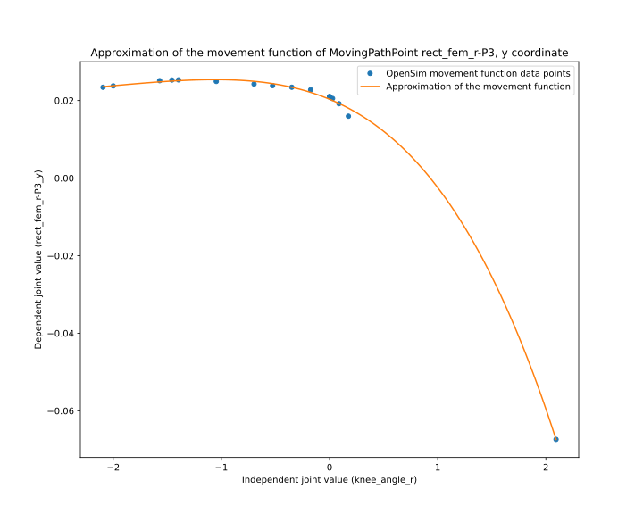
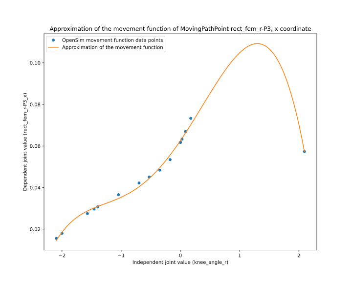

.. _XML Conversion:

Step 1: XML Conversion
~~~~~~~~~~~~~~~~~~~~~~~~

In this step, the OpenSim OSIM file is converted to a MuJoCO XML file. The conversion process is based on and largely similar to the previous `O2MConverter <https://github.com/aikkala/O2MConverter>`_, but rewritten in a way to modularize the code. The converter contains a separate Python class for each OpenSim XML element (called `parsers`), that is responsible for converting the element from OpenSim to MuJoCo. This architecture provides a flexible way to extend the parsers, or suggest improvements via pull requests.

The module :py:mod:`myoconverter.xml` contains all code related to this conversion step -- see especially :py:func:`myoconverter.xml.converter.convert`.

Conversion Process
##################

Below you can find a brief explanation of how each element of an OpenSim model is converted to MuJoCo. 

Ground
******

A *Ground* element may or may not be present in an OpenSim model. If a *Ground* is present, it is treated as a special case of an OpenSim *Body* element, see *BodySet* below.

ConstraintSet
*************

*ConstraintSet* may contain different types of constraints to e.g. define how a specific degree-of-freedom is dependent on another degree-of-freedom.

Such constraints can also be defined in MuJoCo, with the exception that in OpenSim these dependencies may be defined with splines, whereas MuJoCo uses quartic functions. As we approximate splines with quartic functions, some inaccuracies may remain. During the conversion process these approximations are plotted as figures, see figure below for an example.

.. image:: images/wrist_hand_r1_con.svg
  :width: 600
  :alt: Approximation of a CoordinateCouplerConstraint

See :py:mod:`myoconverter.xml.constraints` for all types of constraints that are currently supported.

BodySet
*******

*BodySet* includes all *Body* elements that define the skeleton of a model. Each *Body* may have one or multiple meshes, that are converted into STL file format for the MuJoCo model.

*Body* elements and related meshes are represented in a similar way in MuJoCo (via *body* and *geom* elements), making the conversion a straight-forward process.

See :py:mod:`myoconverter.xml.bodies` for all types of bodies that are currently supported.

WrapObjectSet
*************

*WrapObjectSet* defines wrapping objects, over which tendons may wrap. MuJoCo supports similar functionality via *tendon/spatial/geom*, but the selection of wrapping objects is slightly narrower; OpenSim has wrapping objects for cylinders, spheres, ellipsoids, and tori, whereas MuJoCo only offers *sphere* and *cylinder* geoms for this purpose. The OpenSim elements *WrappingTorus* and *WrappingEllipsoid* are approximated with *sphere* geoms, and the position of *WrapEllipsoid* is further optimised in subsequent optimisation steps.

See :py:mod:`myoconverter.xml.wrap_objects` for all types of wrap objects that are currently supported.

JointSet
********

*Body* elements of a model are linked together via *Joint* elements, defined in the OpenSim model's *JointSet*. Each *Joint* has a parent *Body* and a child *Body*, and the joint specifies how these bodies translate and rotate with respect to each other.

As with *Body* elements, *Joint* elements are represented in a MuJoCo in a quite similar way (via *joint* elements). However, there are three major differences that make the conversion of *Joint* elements difficult: 1) the parameterisation of joints are different, 2) the attributes of joints are different, and 3) we model spline dependencies with quartic functions. 

1) Parameterisation of joints

Joints are parameterized differently in OpenSim and MuJoCo. In OpenSim, a *Coordinate* (e.g. *flexion* in the *mobl_arms* model) parameterises a *CustomJoint*. The Coordinate itself can have a range of values to which it is bound (e.g. for *flexion* the range is [-1.22, 1.22]). A CustomJoint has 3 rotational transforms and 3 spatial transforms. Each of these transforms can be dependent on the Coordinate. For example, *rotation3* in the *radiocarpal* CustomJoint (where *flexion* is defined), has a linear dependency on *flexion* , such that the original range of the Coordinate [-1.22, 1.22] is mapped to a new range [-0.61, 0.61]. In MuJoCo the joints aren't parameterised in this way, but these dependencies can be modelled with equality constraints. During the conversion process, the Coordinate *flexion* is "designated" to be a specific MuJoCo joint, i.e., *rotation3* of the OpenSim model is basically defined to be the *flexion* joint in the MuJoCo model. To make matters worse, other joints in the OpenSim model (like *wrist_hand_r3*) can be dependent on the *flexion* Coordinate. But now *flexion* is defined to be a joint in the MuJoCo model, which can have a different range ([-0.61, 0.61] as per the *rotation3* joint) from the original range of the *flexion* Coordinate ([-1.22, 1.22]). Modelling these dependencies is tricky, and some inaccuracies may remain in the converted model.

2) Attributes of joints

The attributes defining the dynamics of joint movement are different in OpenSim and MuJoCo. During the conversion process these attributes are converted as faithfully as possible, but, some inaccuracies may remain.

3) Modelling splines with quartic functions

A specific degree-of-freedom (e.g. a translational transform of a *CustomJoint* element) may have a non-linear dependency on a *Coordinate* that parameterises the joint. In OpenSim these dependencies are often modelled with splines, which we approximate with quartic polynomials in the converted model. These approximations may introduce some inaccuracies in the movements of the joints. See figure below for an example of a such approximation.

.. image:: images/knee_r_translation1.svg
  :width: 600
  :alt: Approximation of a spline dependency between a dependent and an independent joint

See :py:mod:`myoconverter.xml.joints` for all types of joints that are currently supported.

ForceSet
********

*ForceSet* defines the actuators that produce forces acting on tendons that are fixed to the bodies. MuJoCo supports actuators that model similar musculo-tendon units as defined in OpenSim, but the implementation details are significantly different. These implementation details are a major source of inaccuracy during the conversion process. We try to copy the attributes as faithfully as possible during the conversion process, but this is not always possible. Some MuJoCo muscle parameters, such as *lengthrange*, *dynprm*, *gainprm*, *biasprm*, are set to arbitrary default values during conversion, but are then further optimised in subsequent optimisation steps. There may still remain some muscle parameters that are not converted nor optimised, and we note that the muscle/force parsers require further development.

See :py:mod:`myoconverter.xml.forces` for all types of forces that are currently supported.

PathPointSet
************

*PathPointSet* defines a tendon's fixation points to bodies. MuJoCo supports similar functionality via *tendon/spatial/site* elements. There are two main sources of inaccuracy related to specifically the conversion process of OpenSim's *ConditionalPathPoint* and *MovingPathPoint* elements.

1) Conversion of *MovingPathPoint*

A *MovingPathPoint* describes how a path point moves w.r.t a degree-of-freedom. To model the movement of a moving path point, we need to create an imaginary *body*, to which a path point is fixed, and a set of *joints* and *equality/joint* constraints to move the body according to the dependencies. These dependencies may be defined via splines in OpenSim, but in the converted model we use quartic polynomials, which introduce some inaccuracies. See the figures below for an example of a good approximation (left), and a not-so-good approximation (right).

|mov-path-point-1| |mov-path-point-2|

2) Conversion of *ConditionalPathPoint*

*ConditionalPathPoints* define path points for muscle tendons which are active only if a specific condition is met, e.g., if a joint value is between some range. In MuJoCo we can't enable/disable tendon path points run-time, so we need to be more creative. Essentially the *ConditionalPathPoints* are modelled as *MovingPathPoints*, where the conditional path point coincides with an "anchoring" static path point when the condition is not met, and then moves to the actual position once the condition is met. If a conditional path point cannot be "anchored" to a static path point, then it is modelled as a static *PathPoint*.

The movement of a conditional path point is modelled either as a step function (path point is active when joint value is higher/lower than a threshold), or as a rectangular function (path point is active when joint value is between some range). It is not possible to model a step or a rectangular function with a quartic function in MuJoCo, so we simply approximate the step function with a linear function (see left figure below), and the rectangular function with a quadratic function (see right figure below). These approximations are agnostic to where exactly the step or rectangle is located, but rather make sure the conditional path point never goes outside its defined range. We have found this to be a good enough approximation.

|cond-path-point-1| |cond-path-point-2|

.. |cond-path-point-1| image:: images/vas_int_r-P3_y.svg
   :width: 45%
   :alt: An approximation of a step function

.. |cond-path-point-2| image:: images/psoas_r-P3_x.svg
   :width: 45%
   :alt: An approximation of a rectangular function

See :py:mod:`myoconverter.xml.path_points` for all types of path points that are currently supported.

PathWrapSet
***********

*PathWrapSet* defines how a tendon wraps around *WrapObjects*. Although MuJoCo supports similar behaviour for *tendon* elements, the conversion process of *PathWraps* is likely the most difficult and imprecise part of the model conversion step. 

Parsing and converting wrapping site locations (*PathWrap* elements in the OpenSim model) is largely based on heuristics. If the wrapping site locations are not defined in the OpenSim model (via the *range* parameter of a *PathWrap*), we try to approximate wrapping site locations based on distances to wrapping objects. Specifically, we calculate distances between tendons (or segments of tendons) and all applicable wrapping objects, and decide the wrapping sites based on those distances -- if a segment (two consecutive sites) is close enough to a wrapping object, we add a wrapping site to the MuJoCo model between those sites. This approach only works with static path points, and not *ConditionalPathPoints* or *MovingPathPoints*, and the approach also relies on the assumption that wrapping objects are always close to the tendons (distances are estimated when MuJoCo model is in default pose). However, the locations of wrapping sites are later further optimized in the moment arm optimisation step. 

See :py:mod:`myoconverter.xml.path_wraps` for all types of path wraps that are currently supported.

MarkerSet
*********

*MarkerSet* defines positions of markers in the OpenSim model, that are originally meant for e.g. scaling of a biomechanical model to a specific subject's anatomy. These marker positions are converted to the MuJoCo model as well, and we use them in the later optimisation steps. 

See :py:mod:`myoconverter.xml.markers` for all types of markers that are currently supported.

